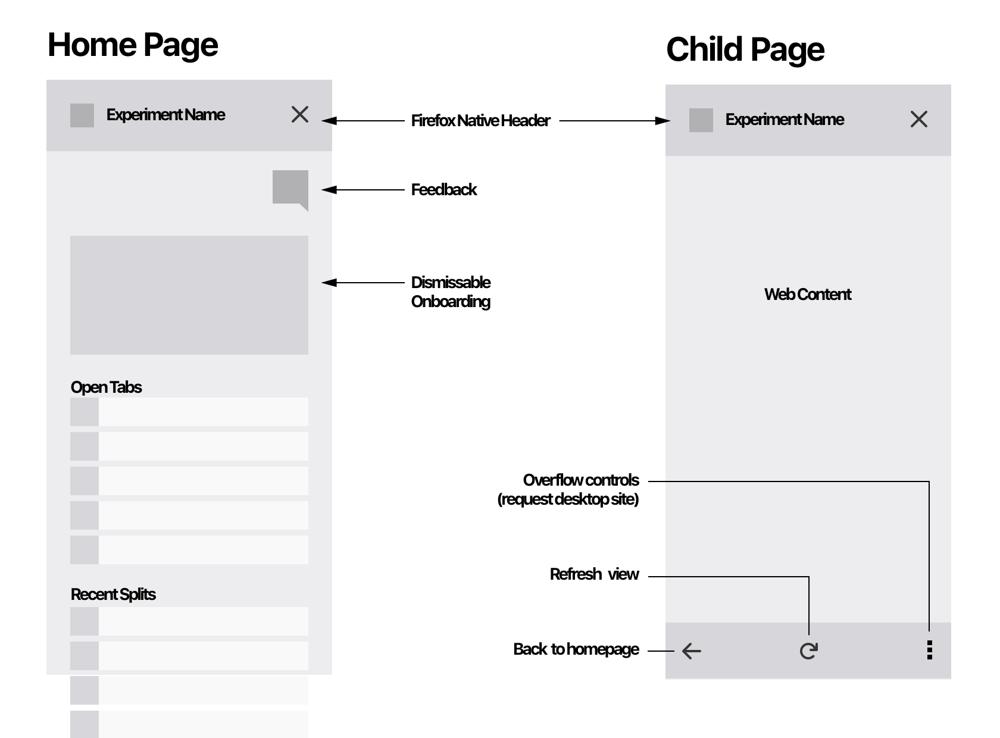

### In General
- [ ] It should generally match Photon styles.
- [ ] It should have a way for users to provide feedback without leaving the experiment.
- [ ] It should match final visual specs.

### Context Clicks
- [ ] It should register a _link_ context menu item for opening sites in the sidebar
- [ ] It should register a _page_ and _tab_ context menu item for opening sites in the sidebar
- [ ] Both context menu buttons should include the extension icon

### Sidebar Homepage
- [ ] It should have a homepage
- [ ] It should have disimissable onboarding content (text + icon for MVP)
- [ ] It should show a list of currently open tabs
- [ ] It should show a list of recently sidebarred tabs
- [ ] It should have a feedback button that links to an external survey with the query params `ver={add-on-version}`, `ref={sidebar}` and `rel={firefox-release}`
- [ ] It should be titled with the extension name
- [ ] It should include the extension icon in the header

### Sidebar WebView
- [ ] It should include a back button to return to the sidebar homepage
- [ ] It should open clicked links in a new tab in the active window
- [ ] It should inlude a refresh button to refresh the page
- [ ] It should render websites using a common mobile header
- [ ] It should let users switch to a normal desktop header
- [ ] It should remember per site if users make the choice to switch headers 

### Global
- [ ] It should extend the max-width of the sidebar to up to 50% of the total browser window

### Stretch
- [ ] The sidebar tab should be openable by a browserAction. Currently blocked by[this bug](https://bugzilla.mozilla.org/show_bug.cgi?id=1427431).
- [ ] The browser action should accept a fill value of `context-fill`

### A11y
- [ ] All buttons and links should have visible focus states
- [ ] All buttons and links should be accessible via keyed entry (tab selection)
- [ ] All form elements should include appropriate label attributes
- [ ] All grouped buttons should be nested in a <fieldset> and described with a legend
- [ ] All UI should be verified to use A11y friendly contrast ratios
